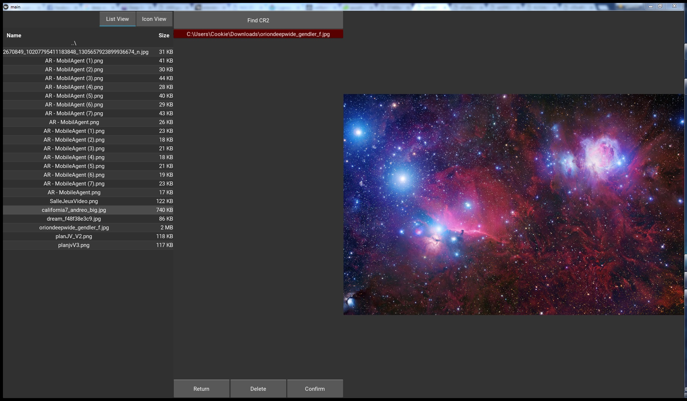
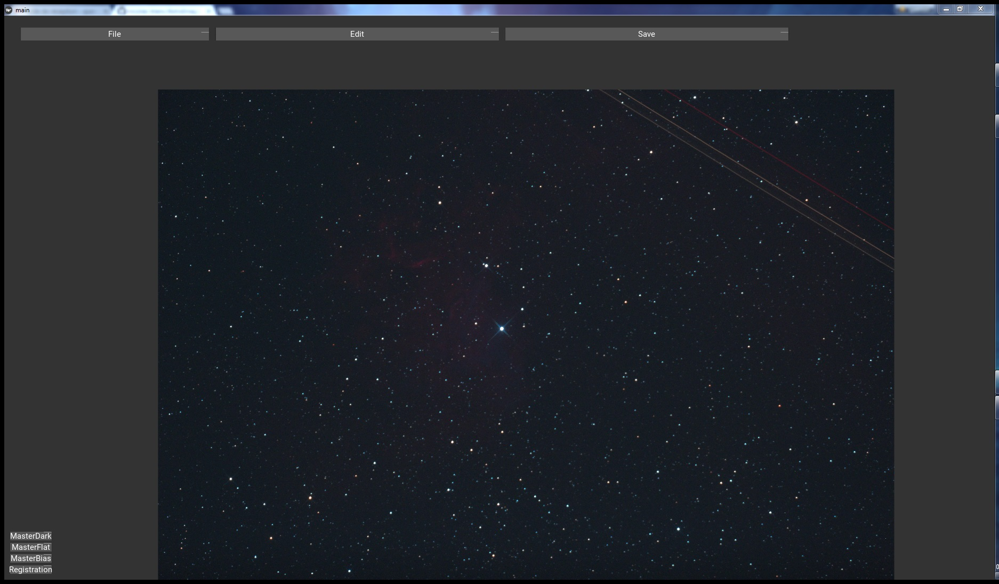
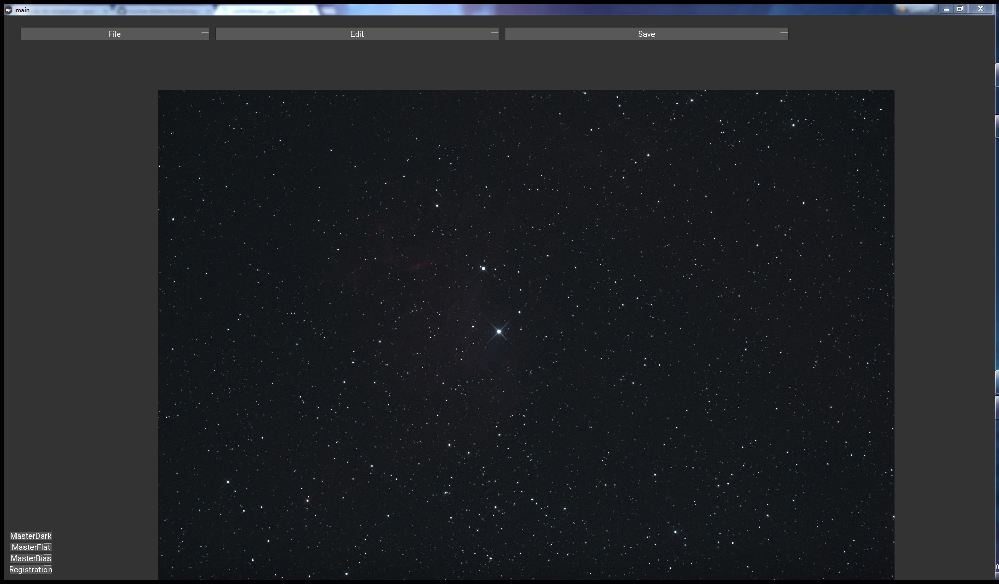

# AstroImage

AstroImage is a pre-processing software for deep sky pictures. It's allow to treat pictures taken by telescope and pre-process them. This treatment include computing of Master Dark, Master Flat and Master Bias. When this work it's done, the software can now start Registration4 and Calibration process5.

With picture obtain by pre-processing state, we as able to do standard process, like Median Filter, Log Correction, Gamma Correction, or Luminosity correction.

## Delivering results through to registration

You can see the result of the registration, applied on 23 lights :

The first image shows an unique light on which we can observe a passage of satelitte. The second image shows the image obtained after registration of 23 lights taken at different moments with a light spatial gap between each shooting.

## Process

All processing functions contained into AstroProcess.py and TreatmentProcess.py works on ndarray (see "http://www.numpy.org/" to know more about numpy and ndarray). This allow to accept all numpy data type, until 32 bits. The only requirement is to have a ndarray of shape (h,w,color) in entrance.

## Limitations

In order to load .RAW images, we use the Rawpy library (see "https://pythonhosted.org/rawpy/") which implement some Demosaic Algorithms. This library allow to convert .RAW to ndarray(h,w,color) of uint16 with a significant loss of quality. So, we can observe on demosaicing images a noise increase and several deviants pixels. It has a knock-on effect on all the processing chain and corrupt the final image quality.

## References
 - Kivy : https://kivy.org/#home
 - Numpy : http://www.numpy.org/
 - RawPy : https://pypi.python.org/pypi/rawpy
 - PyFits : http://www.stsci.edu/portal/ 
 - Dialou : http://astro.dialou.fr/
 - Astrosurf : http://www.astrosurf.com/
